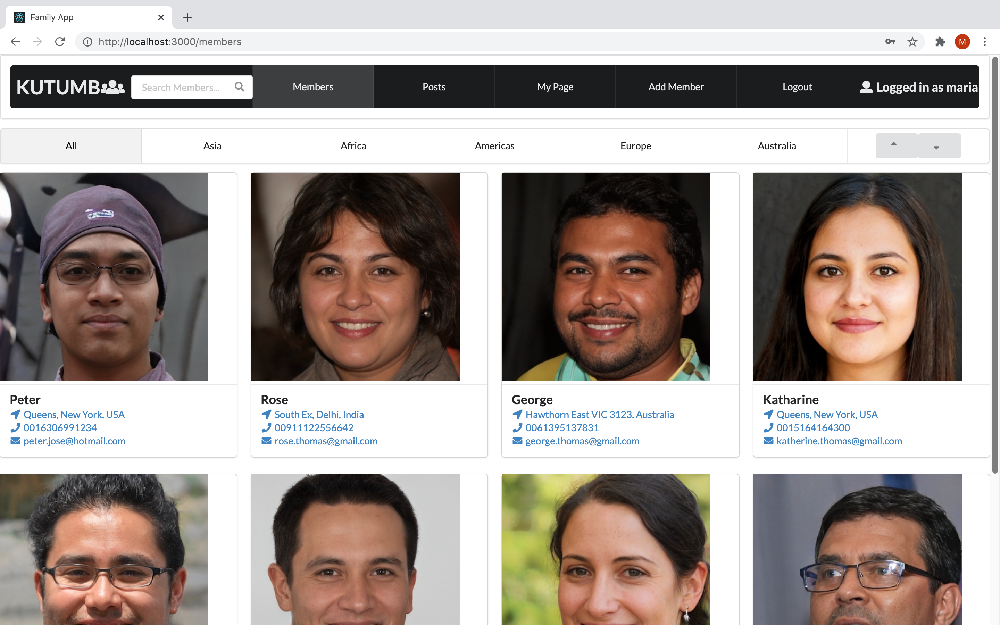

## Kutumb Backend

This is the backend repo of Kutumb, an app for family networking. 

### Tech Stack

* React.js
* Ruby on Rails API
* PostgreSQL DB

### Clone the repo, cd into the folder and run the following commands to start Rails server.

* bundle install
* rails db:create
* rails db:migrate
* rails s -p 3001

[Frontend Repo](https://github.com/mariamoljames/kutumb-frontend)